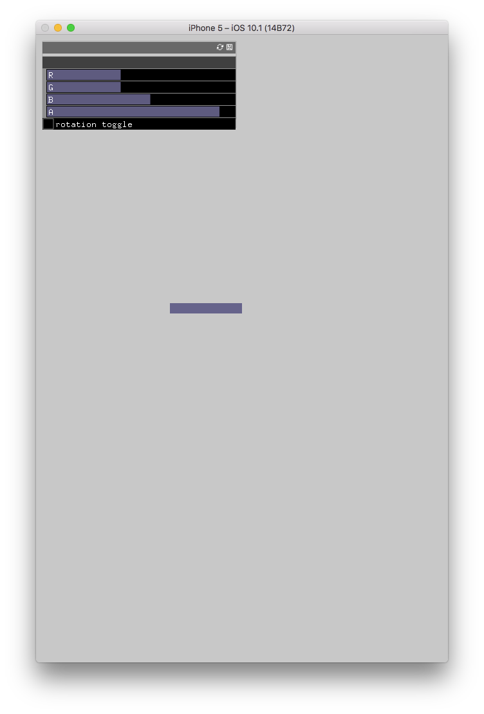
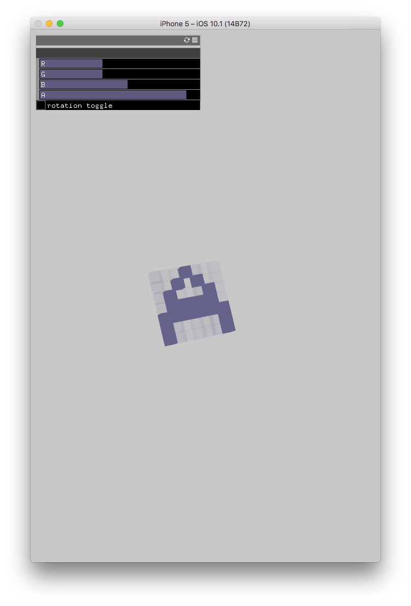

A messy little iOS app using [OpenFrameworks](http://openframeworks.cc/). 

Build a 3D object by pushing cubes into the screen. While you are building you can only view your object from the top, in a 2D perspective. 
This makes the process a bit more challenging. Below is a screenshot of an object in build mode, looking from the top down.

Click the 'rotation toggle' button to switch to 3D mode so that you can see what you have built. The below screenshot is of the same object as above, but in 3D mode.

